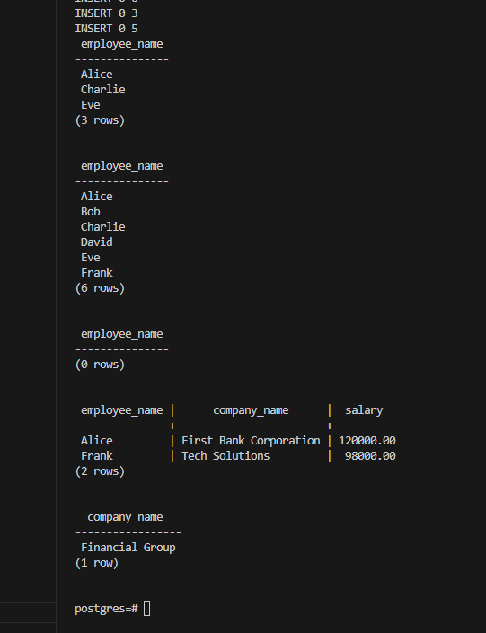
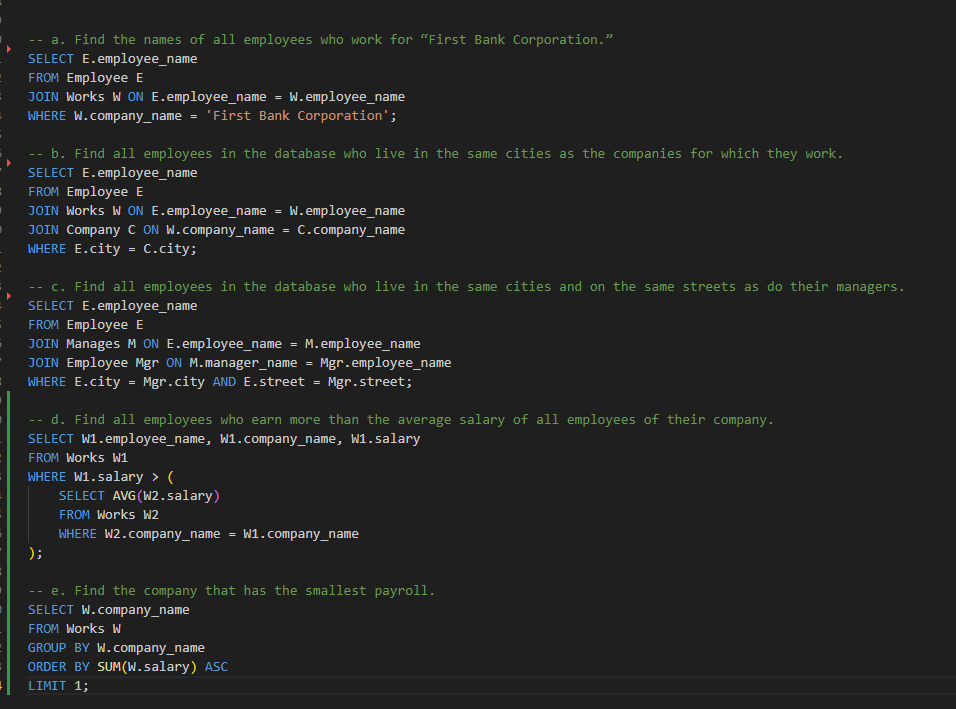

# DSC-E3.12

Employee (employee_name, street, city)
Works (employee_name, company_name, salary)
Company (company_name, city)
Manages (employee_name, manager_name)

Consider the employee database of Figure 3.20, where the primary keys are underlined. Give an expression in SQL for each of the following queries:

a. Find the names of all employees who work for “First Bank Corporation.”

b. Find all employees in the database who live in the same cities as the companies for which they work.

c. Find all employees in the database who live in the same cities and on the same streets as do their managers.

d. Find all employees who earn more than the average salary of all employees of their company.

e. Find the company that has the smallest payroll.

